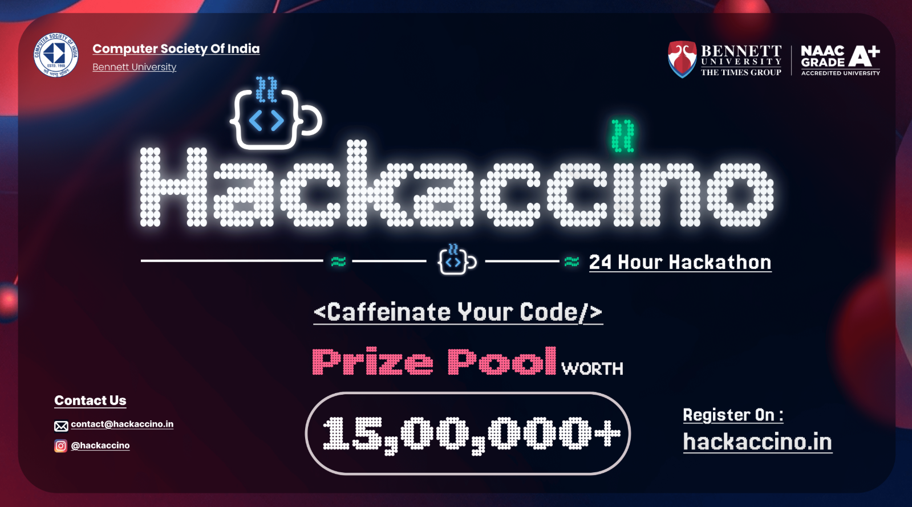
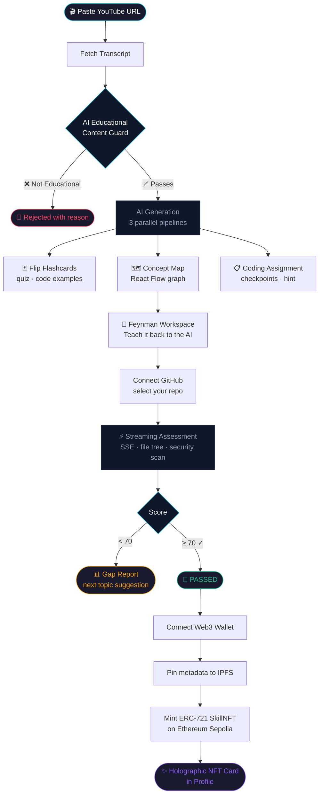

<div align="center">



# LearnLoop

**Turn any YouTube video into a gauntlet. Pass it. Own the proof on-chain.**

<br/>

[](https://nextjs.org)
[](https://www.typescriptlang.org)
[](https://tailwindcss.com)
[](https://www.framer.com/motion)
[](https://reactflow.dev)

[](https://anthropic.com)
[](https://openrouter.ai)
[](https://appwrite.io)
[](https://github.com)

[](https://soliditylang.org)
[](https://hardhat.org)
[](https://ethereum.org)
[](https://pinata.cloud)
[](https://wagmi.sh)

<br/>

---

### Built at **Hackaccino** 🏆 &nbsp;·&nbsp; Team **Yonex**

<br/>

**Powered by**

<a href="https://appwrite.io" target="_blank">
  
</a>
&nbsp;&nbsp;


</div>

---

## What Is LearnLoop?

Most people watch tutorials and forget everything within 48 hours.

**LearnLoop closes that gap.** Paste any YouTube educational video. The AI reads its transcript, builds a personalised learning path, assigns you a real coding challenge, grades your GitHub repo checkpoint by checkpoint — and if you pass, mints you a tamper-proof **ERC-721 Proof of Learning NFT** on Ethereum Sepolia.

No more passive watching. Every video becomes a gauntlet. Every pass becomes a credential.

---

## The Full Flow



---

## Core Features

### 🎬 AI Learning Path Generation
The moment you submit a URL, LearnLoop fetches the full video transcript and fires three parallel AI pipelines:

- **Flashcards** — flip-card deck with plain-English explanations, real code examples, and a mini quiz per card
- **Concept Map** — interactive React Flow graph showing which concepts depend on which, with edges flowing from fundamentals to advanced ideas
- **Coding Assignment** — scoped, beginner-friendly project brief with specific checkpoints, a starter idea, and an optional quiz

### 🛡️ Educational Content Guard
Every submitted URL is validated by AI before any generation begins. Music videos, vlogs, gaming streams, and entertainment are blocked — the rejection screen explains exactly why, so users know what to try instead. Only real learning content gets through.

### 🧠 Feynman Technique Workspace
For each concept node on the map, learners can open the Feynman workspace — a Socratic dialogue where you explain the concept back to the AI in your own words. The AI evaluates depth of understanding, identifies what's fuzzy, and keeps pushing until the concept genuinely clicks. Not a quiz. Not Q&A. A thinking partner.

### ⚡ Streaming Code Assessment
Connect with GitHub OAuth, pick any repo (public or private), and trigger the grader. Under the hood:

1. Walks the complete file tree, filters relevant source files
2. Runs a security scan — exposed secrets, dangerous patterns
3. **Streams live events over Server-Sent Events** → file discovered → checkpoint evaluated → AI verdict — the UI updates in real time like a terminal
4. Delivers a full scored report: checklist against every assignment checkpoint, strengths, gaps, and the recommended next topic

No waiting for a single response. You watch the grader think.

### 🏅 Proof of Learning NFT
Score ≥ 70 and connect a Web3 wallet. LearnLoop:

1. Encodes NFT metadata (topic, score, date, source URL) and pins it to IPFS via Pinata (falls back to `data:` URI if Pinata is unavailable)
2. Calls `mintSkillNFT(learnerAddress, ipfsURI)` on the deployed `SkillNFT` ERC-721 contract
3. Shows a holographic NFT card in your profile with a live Etherscan link

Every certificate is server-minted and on-chain. Nobody can forge a LearnLoop credential.

### 📚 Session History & Appwrite Caching
Every completed learning path is persisted to **Appwrite**. Click any session in the sidebar — flashcards, concept map, assignment, and assessment score load instantly from the database. Zero re-API calls, zero wait.

---

## Architecture

```
src/
├── app/
│   ├── dashboard/          ← YouTube URL input + landing
│   ├── learn/              ← Flashcards · Concept Map · Assignment
│   │   └── feynman/        ← Feynman Technique workspace
│   ├── assess/             ← GitHub connect · streaming code grader
│   ├── profile/            ← NFT collection · wallet · GitHub card
│   ├── history/            ← Past sessions from Appwrite
│   └── api/
│       ├── ingest/         ← Transcript fetch + educational validation
│       ├── flashcards/     ← AI flashcard generation
│       ├── concept-map/    ← AI concept dependency graph
│       ├── assignment/     ← AI coding assignment brief
│       ├── feynman/        ← Evaluate & re-explain endpoints
│       ├── assess-repo/
│       │   └── stream/     ← SSE streaming code assessment
│       ├── mint-nft/       ← IPFS pin + ERC-721 mint
│       └── auth/           ← GitHub OAuth flow
├── components/
│   ├── ConceptMap.tsx      ← React Flow interactive graph
│   ├── AssignmentCard.tsx  ← Assignment display card
│   ├── ReportModal.tsx     ← Assessment report overlay
│   └── learn/
│       └── LearnWorkspace.tsx ← Feynman dialogue UI
├── lib/
│   ├── openrouter.ts       ← OpenRouter / Claude API client
│   ├── github.ts           ← GitHub REST API helpers
│   ├── appwrite.ts         ← Session persistence (Appwrite)
│   ├── json.ts             ← Robust AI JSON parser (jsonrepair)
│   └── video-validator.ts  ← Educational content guard
└── hooks/
    ├── useGitHubAuth.ts
    └── useWallet.ts
contracts/
└── SkillNFT.sol            ← ERC-721 Proof of Learning contract
```

---

## Tech Stack

| Layer | Technology |
|---|---|
| Framework | Next.js 15 (App Router, RSC) |
| Language | TypeScript |
| Styling | Tailwind CSS v4 + Framer Motion |
| AI Model | Claude 3.5 Sonnet via OpenRouter |
| Auth | GitHub OAuth — custom cookie-based |
| Database | **Appwrite** — session history & caching |
| Graph UI | React Flow |
| Blockchain | Solidity · Hardhat · Ethers.js |
| Network | Ethereum Sepolia testnet |
| NFT Storage | Pinata (IPFS) with data URI fallback |
| Web3 UI | wagmi · viem · RainbowKit |
| Streaming | Server-Sent Events (SSE) |

---

## Smart Contract

`SkillNFT.sol` is an ERC-721 contract built on OpenZeppelin's `ERC721URIStorage`. Only the deployer wallet (the backend server) can call `mintSkillNFT` — learners cannot self-mint. Every credential is AI-verified before the transaction fires.

Deployed on **Ethereum Sepolia** at `0x76655d5aF921198F64f3E9AeCd1f56D32acc21E0`.

---

## Sponsors

<table>
<tr>
<td align="center" width="200">
  <br/>
  <sub><b>Appwrite</b></sub><br/>
  <sub>Session persistence & real-time database</sub>
</td>
</tr>
</table>

---

<div align="center">

Built in **14 hours** at **Hackaccino** by **Team Yonex** · April 11, 2026

</div>
